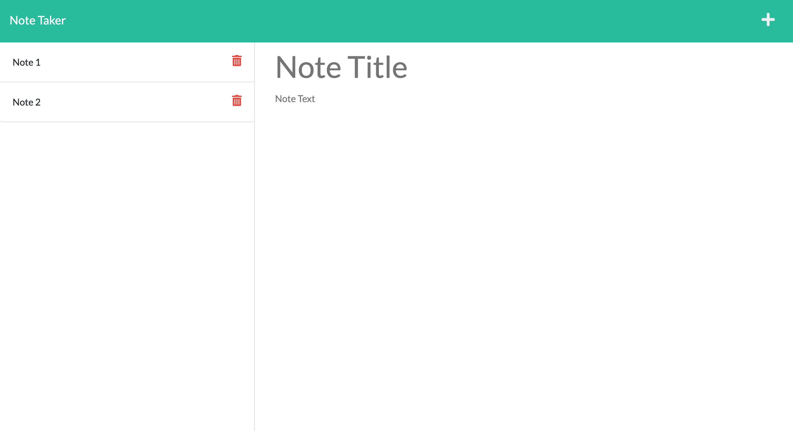

# Note Taker

This app allows a user to create, save, and delete notes.  The requests are routed with through Express server, which interacts with a JSON file as a simple database.

## Screenshots

## Installation and Start Up

To install, `git clone` the repository and run `npm install` to install dependencies. The app can be viewed by running `npm start` in the terminal, and then visiting the appropriate localhost in your browser.

## Live site

Alternatively, you can visit the deployed site [here!](https://note-taker-heroku3.herokuapp.com/)

## Technologies

This app uses HTML, CSS, Javascript, Express, Node.js, and uniqid. It is deployed through Heroku.
